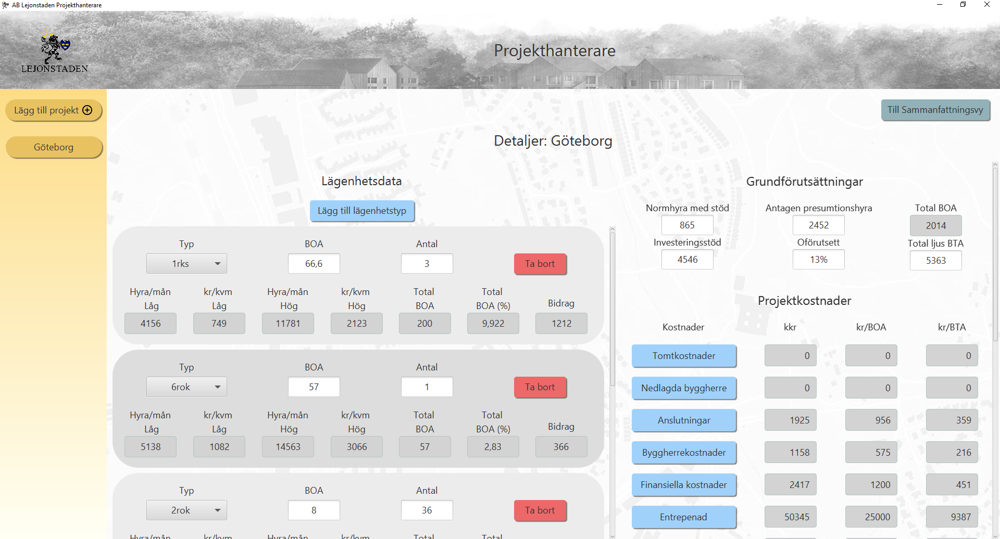

# Agile software project management (DAT257) - 2021
## Team: AXE-N
Members: Name (Github account name)
* Ahmad Al-Aref (alarefahmad)
* Erik Wetter (erikwet)
* Malte Åkvist (amalte)
* Oscar Arvidson (oscarvid)
* Sam Salek (sam123bir)
* Sara Galligani Vardheim (saravardheim)
* Tilda Grönlund (tildagronlund)

## AB Lejonstaden Projekthanterare

### Structure
* Runnable .jar: *target/_build* (JRE is needed to run)
* Executable file: created with Maven command "clean package"

* Documentation (reflections, project scope, etc.): *Dokumentation*
* Source code: *src/main/java/edu/chalmers/axen2021*
* Tests: *src/test/java/edu/chalmers/axen2021*
* Resources (fxml, images, etc.): *src/main/resources*

### External links
* Scrum Board (Trello): https://trello.com/b/COmWfkie/axe-n
